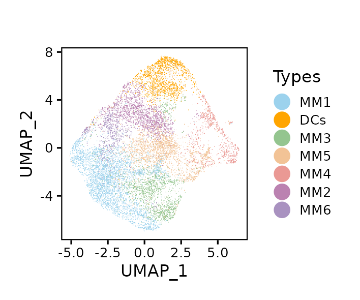
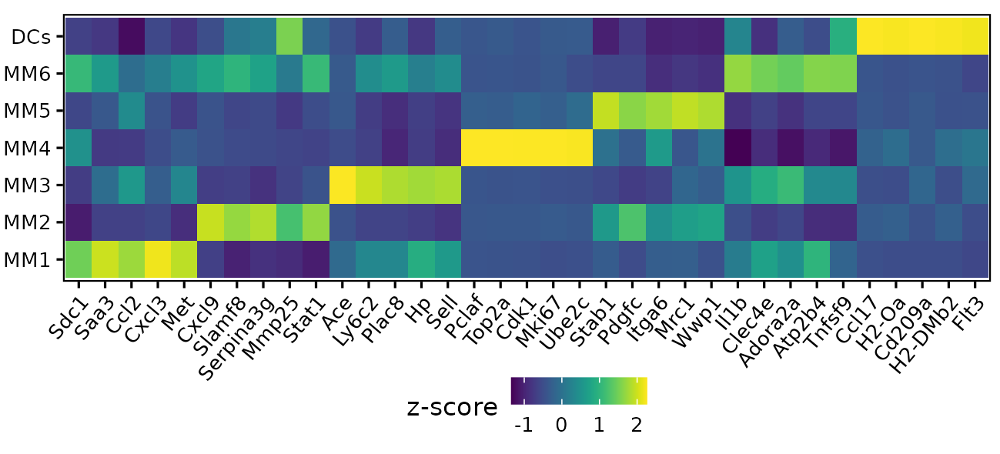
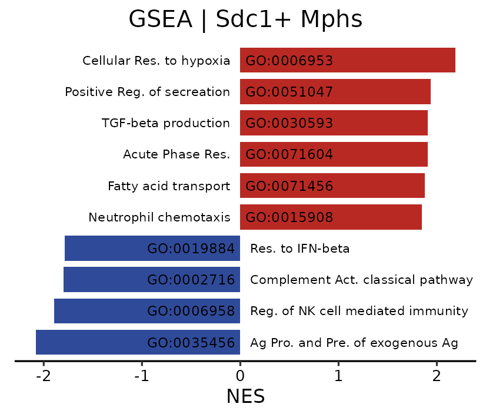
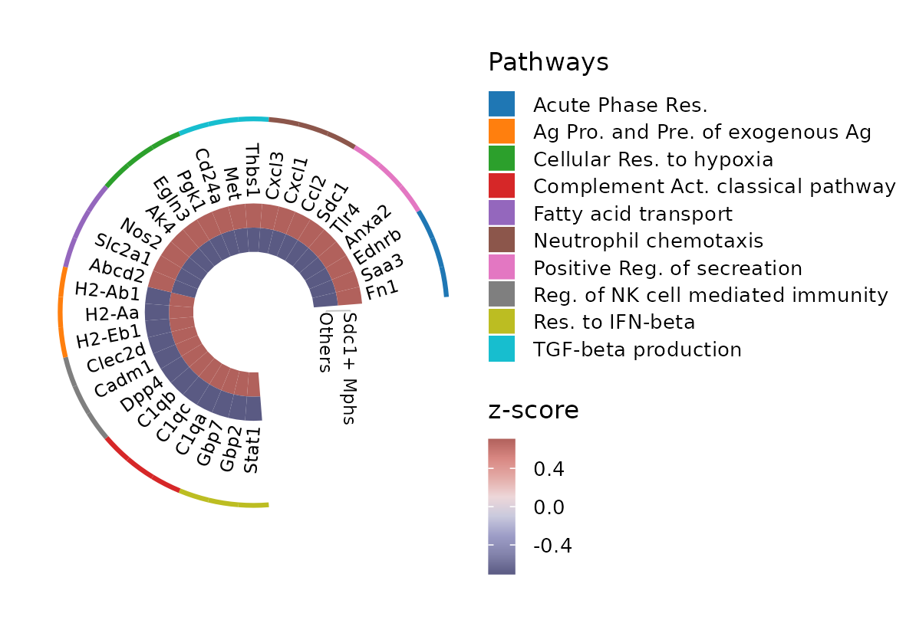

## set-up

```{r set-up}

pkgs <- c("fs", "futile.logger", "configr", "stringr", "ggpubr", "ggthemes", 
          "jhtools", "glue", "ggsci", "patchwork", "tidyverse", "dplyr", "Seurat", 
          "paletteer", "viridis", "ComplexHeatmap", "circlize")  
for (pkg in pkgs){
  suppressPackageStartupMessages(library(pkg, character.only = T))
}
project <- "panlab"
dataset <- "wangchao"
species <- "mouse"
workdir <- glue("~/projects/{project}/output/{dataset}/{species}/tenx/figures_260414")
workdir %>% fs::dir_create() %>% setwd()

config_fn <- "/cluster/home/danyang_jh/projects/panlab/output/wangchao/mouse/tenx/rds/config.yaml"
mph_cols <- jhtools::show_me_the_colors(config_fn, "mph_cols")
trends_cols <- jhtools::show_me_the_colors(config_fn, "trends_cols")

my_theme1 <- theme_classic(base_size = 8) +
  theme(legend.key.size = unit(3, "mm"), axis.text = element_text(color = "black"),
        axis.line = element_blank(), axis.ticks = element_line(color = "black"), 
        panel.border = element_rect(linewidth = .5, color = "black", fill = NA))
glue("{workdir}/fig2") %>% fs::dir_create() %>% setwd()

```

## fig2a-b: UMAP & marker heatmap of mouse Mphs

```{r fig2a-b}
## UMAP of myeloid -----
fig2_mph <- read_rds("../rds/fig2_mph_v260130.rds")
Idents(fig2_mph) <- fig2_mph$Types

fig2a <- Seurat::DimPlot(fig2_mph, group.by = "Types", pt.size = 1.5, raster = T, reduction = "umap_hmy") + 
  labs(title = "", color = "Types") + scale_color_manual(values = cols_mph) + my_theme1 + 
  labs(x = "UMAP_1", y = "UMAP_2")
ggsave("fig2a_5seq_umap.pdf", fig2a, width = 6, height = 5, unit = "cm")
ggsave("fig2a_5seq_umap.png", fig2a, width = 6, height = 5, unit = "cm")

### marker table ------
table5v <- Seurat::FindAllMarkers(fig2_mph, group.by = "Types", logfc.threshold = 0)
write_csv(table5v, "rds/table5v_fig2b_mks_mph_5seq.csv.gz", num_threads = 4)

## fig2b: marker heatmap -----
lab_sdc1 <- c("Sdc1", "Saa3", "Ccl2", "Cxcl3", "Met")
lab_mki67 <- c("Pclaf", "Top2a", "Cdk1", "Mki67", "Ube2c")
lab_plac8 <- c("Ace", "Ly6c2", "Plac8", "Hp", "Sell")
lab_cxcl9 <- c("Cxcl9", "Slamf8", "Serpina3g", "Mmp25", "Stat1")
lab_mrc1 <- c("Stab1", "Pdgfc", "Itga6", "Mrc1", "Wwp1")
lab_il1b <- c("Il1b", "Clec4e", "Adora2a", "Atp2b4", "Tnfsf9")
lab_ag <- c("Ccl17", "H2-Oa", "Cd209a", "H2-DMb2", "Flt3")

labs_5seq <- c(lab_sdc1, lab_mki67, lab_plac8, lab_cxcl9, lab_mrc1, lab_il1b, lab_ag) %>% 
  as.character() %>% fct(levels = c(lab_sdc1, lab_cxcl9, lab_plac8, lab_mki67, lab_mrc1, lab_il1b, lab_ag))

expr_avg <- Seurat::AverageExpression(fig2_mph, assays = "RNA", slot = "data", group.by = "Types", 
                                      features = as.character(labs_5seq), 
                                      return.seurat = F)[[1]] %>% as.matrix()
expr_avg2 <- expr_avg %>% t() %>% scale() %>% t() %>% 
  as.data.frame() %>% rownames_to_column("gene") %>% 
  tidyr::pivot_longer(names_to = "Types", values_to = "z-score", cols = -1) %>% 
  mutate(gene = gene %>% as.character() %>% fct(levels = levels(labs_5seq)), 
         Types = Types %>% as.character() %>% 
           fct(levels = c(paste0("MM", 1:6), "DCs")))
fig2b <- ggplot2::ggplot(expr_avg2, aes(x = gene, y = Types, fill = `z-score`)) + 
  ggplot2::geom_tile() + my_theme1 + 
  theme(axis.text.x = element_text(angle = 50, hjust = 1), legend.position = "bottom", 
        plot.margin = margin(l = -.3, r = .1, t = -.3, b = .2, unit = "cm"), 
        legend.margin = margin(t = -.7, unit = "cm")) + 
  labs(x = "", y = "", title = "") + viridis::scale_fill_viridis()
ggsave("fig2b_5seq_marker_genes_v260130.pdf", fig2b, width = 11, height = 5, unit = "cm")
ggsave("fig2b_5seq_marker_genes_v260130.png", fig2b, width = 11, height = 5, unit = "cm")


```





## GSEA barplot of Sdc1+ Mphs

```{r fig2c}
### fig2c: GSEA results of Sdc1+ Mph -----
gsea_res_all <- read_csv(
  "/cluster/home/danyang_jh/projects/panlab/output/wangchao/mouse/tenx/rds/fig2c_gsea_res.csv"
)

go_selected <- c("Gobp_Acute_Phase_Response", "Gobp_Positive_Regulation_Of_Secretion", 
                 "Gobp_Neutrophil_Chemotaxis", "Gobp_Transforming_Growth_Factor_Beta_Production", 
                 "Gobp_Cellular_Response_To_Hypoxia", "Gobp_Fatty_Acid_Transport", 
                 "Gobp_Antigen_Processing_And_Presentation_Of_Exogenous_Antigen", 
                 "Gobp_Regulation_Of_Natural_Killer_Cell_Mediated_Immunity", 
                 "Gobp_Complement_Activation_Classical_Pathway", 
                 'Gobp_Response_To_Interferon_Beta') %>% stringr::str_to_upper()
gsea_res <- gsea_res_all %>% 
  dplyr::filter(NAME %in% go_selected) %>% 
  dplyr::distinct() %>% mutate(NAME = NAME %>% str_replace_all("_", " ") %>% str_to_lower())
go_terms <- c(
  "GO:0006953" = "GOBP_ACUTE_PHASE_RESPONSE",
  "GO:0051047" = "GOBP_POSITIVE_REGULATION_OF_SECRETION",
  "GO:0030593" = "GOBP_NEUTROPHIL_CHEMOTAXIS",
  "GO:0071604" = "GOBP_TRANSFORMING_GROWTH_FACTOR_BETA_PRODUCTION",
  "GO:0071456" = "GOBP_CELLULAR_RESPONSE_TO_HYPOXIA",
  "GO:0015908" = "GOBP_FATTY_ACID_TRANSPORT",
  "GO:0019884" = "GOBP_ANTIGEN_PROCESSING_AND_PRESENTATION_OF_EXOGENOUS_ANTIGEN",
  "GO:0002716" = "GOBP_REGULATION_OF_NATURAL_KILLER_CELL_MEDIATED_IMMUNITY",
  "GO:0006958" = "GOBP_COMPLEMENT_ACTIVATION_CLASSICAL_PATHWAY",
  "GO:0035456" = "GOBP_RESPONSE_TO_INTERFERON_BETA"
) %>% names()
plot_title <- "GSEA | Sdc1+ Mphs"

gsea_sel <- gsea_res %>% 
  mutate(trends = case_when(NES > 0 ~ "up", TRUE ~ "down"), all_ids = go_terms) %>% 
  dplyr::group_by(trends) %>% 
  dplyr::arrange(NES) %>% dplyr::mutate(NAME = fct(NAME)) %>% 
  dplyr::mutate(up_ids = case_when(NES > 0 ~ all_ids, TRUE ~ NA), 
                down_ids = case_when(NES < 0 ~ all_ids, TRUE ~ NA)) %>% 
  #### in case there are many matches
  mutate(NAME = NAME %>% str_sub(start = 6) %>% str_to_sentence()) %>% 
  ungroup() %>% dplyr::arrange(NES) %>% mutate(NAME = fct(NAME)) %>% 
  mutate(NAME = NAME %>% fct_recode("Acute Phase Res." = "Acute phase response", 
                                    "Ag Pro. and Pre. of exogenous Ag" = "Antigen processing and presentation of exogenous antigen", 
                                    "Positive Reg. of secreation" = "Positive regulation of secretion", 
                                    "Neutrophil chemotaxis" = "Neutrophil chemotaxis", 
                                    "TGF-beta production" = "Transforming growth factor beta production", 
                                    "Cellular Res. to hypoxia" = "Cellular response to hypoxia", 
                                    "Fatty acid transport" = "Fatty acid transport", 
                                    "Reg. of NK cell mediated immunity" = "Regulation of natural killer cell mediated immunity", 
                                    "Complement Act. classical pathway" = "Complement activation classical pathway", 
                                    "Res. to IFN-beta" = "Response to interferon beta")) %>% 
  dplyr::mutate(up_terms = case_when(NES > 0 ~ NAME, TRUE ~ NA), 
                down_terms = case_when(NES < 0 ~ NAME, TRUE ~ NA))

fig2c <- ggplot2::ggplot(gsea_sel, aes(x = NES, y = NAME, fill = trends)) + 
  geom_bar(stat = "identity", width = .8) + scale_fill_manual(values = trends_cols) + 
  geom_text(aes(label = up_terms, x = -0.1), 
            size = 1.8, vjust = .5, hjust = 1) + 
  geom_text(aes(label = down_terms, x = 0.1), 
            size = 1.8, vjust = .5, hjust = 0) + 
  geom_text(aes(label = up_ids, x = 0.5), size = 2) + 
  geom_text(aes(label = down_ids, x = -0.5), size = 2) + 
  theme_classic(base_size = 8) + 
  theme(axis.title.y = element_blank(), legend.position = "none", axis.ticks.y = element_blank(), 
        axis.text.y = element_blank(), axis.line.y = element_blank(), 
        plot.title = element_text(hjust = 0.5), axis.text = element_text(color = "black")) + 
  labs(title = plot_title) 
ggsave("fig2c_gsea_res_Sdc1_Mph_barplot.pdf", fig2c, height = 6, width = 7, unit = "cm")
ggsave("fig2c_gsea_res_Sdc1_Mph_barplot.png", fig2c, height = 6, width = 7, unit = "cm")


```



## pathway representative genes

```{r fig2d}
## fig2d: representative genes in selected pathways -----
library(ggtree)
library(treeio)
library(ape)
library(ggnewscale)
library(ggtreeExtra)
library(MetBrewer)

genes_pth1 <- c("Fn1",	'Saa3',	"Ednrb")
genes_pth2 <- c("Anxa2",	"Tlr4",	"Sdc1")
genes_pth3 <- c("Ccl2", "Cxcl1", "Cxcl3")
genes_pth4 <- c("Thbs1", "Met", "Cd24a")
genes_pth5 <- c("Pgk1", "Egln3", "Ak4")
genes_pth6 <- c("Nos2", "Slc2a1", "Abcd2")
genes_pth7 <- c("H2-Ab1", "H2-Aa", "H2-Eb1")
genes_pth8 <- c("Clec2d", "Cadm1", "Dpp4")
genes_pth9 <- c("C1qb", "C1qc", "C1qa")
genes_pth10 <- c("Gbp7", "Gbp2", "Stat1")
pth_names <- c("Acute Phase Res.", "Positive Reg. of secreation", "Neutrophil chemotaxis", 
               "TGF-beta production", "Cellular Res. to hypoxia", "Fatty acid transport", 
               "Ag Pro. and Pre. of exogenous Ag", "Reg. of NK cell mediated immunity", 
               "Complement Act. classical pathway", "Res. to IFN-beta")
genes_pth <- list(genes_pth1, genes_pth2, genes_pth3, genes_pth4, 
                  genes_pth5, genes_pth6, genes_pth7, genes_pth8, 
                  genes_pth9, genes_pth10) %>% setNames(nm = pth_names)
gene_path_tbl <- genes_pth %>% unlist %>% tibble(gene = ., path = rep(pth_names, each = 3))
fig2_mph$sdc1_ident <- case_when(fig2_mph$Types == "MM1" ~ "Sdc1+ Mphs", TRUE ~ "Others")
df4plot3 <- Seurat::AverageExpression(fig2_mph, features = unlist(genes_pth), group.by = "sdc1_ident",
                                      assays = "RNA", slot = "data", return.seurat = F)[[1]] %>%
  t() %>% scale() %>% t() %>%
  as.data.frame() %>% rownames_to_column("gene") %>% 
  dplyr::left_join(y = gene_path_tbl) %>% 
  mutate(gene = gene %>% as.character() %>% fct(levels = unname(unlist(genes_pth)))) %>% 
  dplyr::arrange(gene)

newick_string <- paste("(", paste(df4plot3$gene, collapse = ","), ");", sep = "")
tree <- read.tree(text = newick_string)
expdata <- df4plot3 %>% select(-path) %>% pivot_longer(-gene)
group <- df4plot3 %>% select(gene, path) %>% mutate(group = "group")

fig2d <- ggtree(tree, branch.length = "none", layout = "circular",linetype = 0, size = 0.5) +
  layout_fan(angle = 90)+  
  geom_fruit(data = expdata, geom = geom_tile,
             mapping = aes(y = gene, x = name, fill = value),
             pwidth = 1, offset = 1,
             axis.params = list(axis = "x", text.angle= -90, text.size = 2, hjust = 0)) + 
  labs(fill = "z-score") + 
  scale_fill_gradientn(colors=rev(met.brewer("Cassatt1")))+
  geom_tiplab(offset = 3.7, size = 2, color = "black")+
  new_scale_fill() +
  geom_fruit(data = group, geom = geom_tile,
             mapping = aes(y = gene,x = group, fill = path),
             pwidth = 0.2, offset = 2) + labs(fill = "Pathways") + 
  ggsci::scale_fill_d3() +
  theme(plot.margin = margin(0,0,0,0,"cm"), legend.position = "right", 
        legend.margin = margin(l = -0.5, t = 0, b = 0, r = 0.1, unit = "cm"), 
        legend.key.size = unit(3, "mm"), text = element_text(size = 8))
ggsave("fig2d_pathways_genes.pdf", fig2d, width = 10, height = 7, unit = "cm")
ggsave("fig2d_pathways_genes.png", fig2d, width = 10, height = 7, unit = "cm")

```


