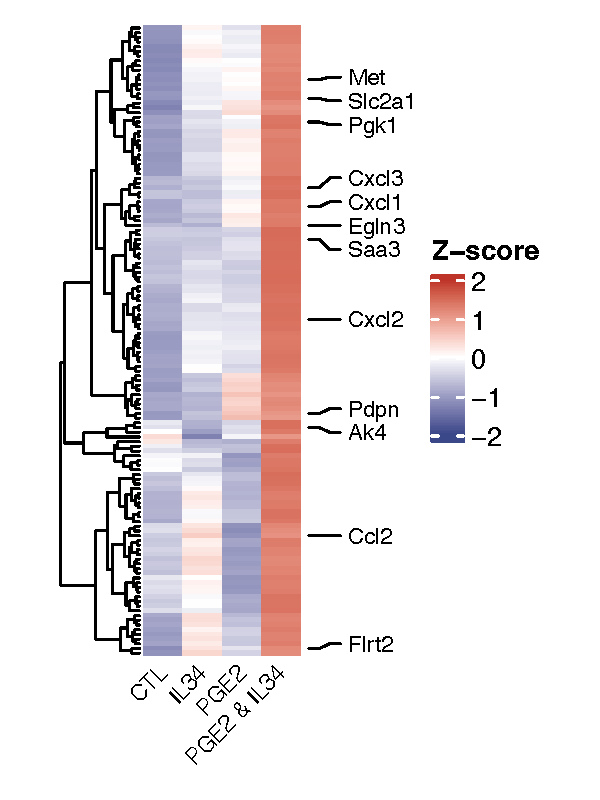
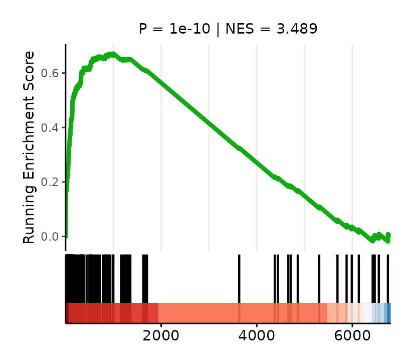
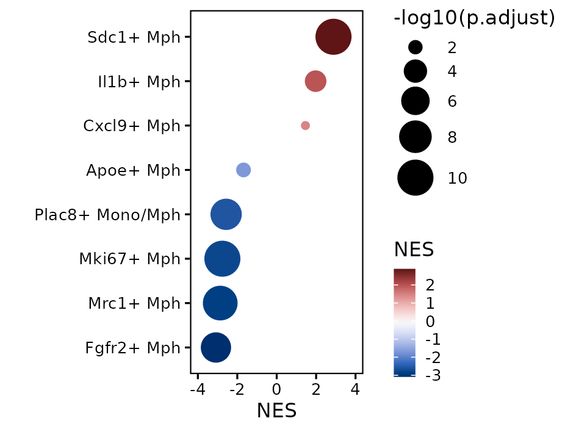

## set-up

```{r set-up}

pkgs <- c("fs", "futile.logger", "configr", "stringr", "ggpubr", "ggthemes", 
          "jhtools", "glue", "ggsci", "patchwork", "tidyverse", "dplyr", "Seurat", 
          "paletteer", "viridis", "ComplexHeatmap", "circlize", "readxl", 
          "clusterProfiler", "enrichplot")  
for (pkg in pkgs){
  suppressPackageStartupMessages(library(pkg, character.only = T))
}
project <- "panlab"
dataset <- "wangchao"
species <- "mouse"
workdir <- glue("~/projects/{project}/output/{dataset}/{species}/tenx/figures_260414")
workdir %>% fs::dir_create() %>% setwd()

config_fn <- "/cluster/home/danyang_jh/projects/panlab/output/wangchao/mouse/tenx/rds/config.yaml"
mph_cols <- jhtools::show_me_the_colors(config_fn, "mph_cols")
my_theme1 <- theme_classic(base_size = 8) +
  theme(legend.key.size = unit(3, "mm"), axis.text = element_text(color = "black"),
        axis.line = element_blank(), axis.ticks = element_line(color = "black"), 
        panel.border = element_rect(linewidth = .5, color = "black", fill = NA))
glue("{workdir}/fig3") %>% fs::dir_create() %>% setwd()

```

## fig3d: consistency of bulk and SCE

```{r fig3d}
## fig3d: consistency of bulk and sce -----

vst_dat3 <- read_csv("../../rds/fig3d_heatmap_df.csv")
gene_labs2 <- c("Pdpn", "Cxcl3", "Ccl2", "Cxcl1", "Ak4", "Met", "Cxcl2", "Saa3", 
                "Egln3", "Flrt2", "Slc2a1", "Pgk1")
labs_idx2 <- which(rownames(vst_dat3) %in% gene_labs2)

top_anot1 <- 
  ComplexHeatmap::rowAnnotation(foo = anno_mark(at = labs_idx2, 
                                                labels = rownames(vst_dat3)[labs_idx2], 
                                                labels_gp = gpar(fontsize = 8)))

col_fun = colorRamp2(c(-2, 0, 2), c("#3A488AFF", "white", "#BE3428FF"))
htp1 <- ComplexHeatmap::Heatmap(vst_dat3, show_row_names = F, cluster_columns = F, 
                                right_annotation = top_anot1, , 
                                column_names_gp = gpar(fontsize = 8), 
                                column_names_rot = 45,
                                name = "Z-score", col = col_fun, 
                                height = unit(8, "cm"), width = unit(2, "cm"))
pdf("fig3d_bulk_mks_heatmap.pdf", width = 3, height = 4)
print(htp1)
dev.off()

```



## fig3e: GSEA evaluation of scRNA-seq cells and bulk-RNAseq treatment

```{r fig3e}
# fig3e1, GSEA of synergized genes based on driver genes -----
csv_fn2 <- "/cluster/home/danyang_jh/projects/panlab/output/wangchao/mouse/tenx/rds/sfig6_driver_genes.csv"
driver_genes <- read_csv(csv_fn2)
input1 <- setNames(driver_genes[[2]], nm = driver_genes[[1]]) %>% sort(decreasing = T)
trm2gn <- tibble(name = "bulk common genes", gene = common_genes)
gsea_res2 <- clusterProfiler::GSEA(input1, minGSSize = 3, pvalueCutoff = 1, TERM2GENE = trm2gn)
pval <- gsea_res2@result$pvalue %>% signif(., 4)
nes <- gsea_res2@result$NES %>% round(digits = 3)
gsea_p1 <- 
  enrichplot::gseaplot2(gsea_res2, geneSetID = 1, subplots = 1:2, pvalue_table = F, 
                        color = "#11aa11FF", base_size = 7, 
                        title = glue("P = {pval} | NES = {nes}"))
gsea_p1[[1]] <- gsea_p1[[1]] + theme(plot.title = element_text(size = 7, hjust = .5))
ggsave("fig3e_bulk_feats_corr_lineage_gsea.pdf", gsea_p1, width = 7, height = 6, unit = "cm")
ggsave("fig3e_bulk_feats_corr_lineage_gsea.png", gsea_p1, width = 7, height = 6, unit = "cm")

### fig3e2: GSEA on marker genes of each Mph subset ----
csv_fn3 <- "/cluster/home/danyang_jh/projects/panlab/output/wangchao/mouse/tenx/rds/fig3e_bulk2sce_gsea_res.csv"
gsea_bulk2sce <- read_csv(csv_fn3) %>% dplyr::arrange((NES)) %>% 
  mutate(celltype = fct(as.character(cluster)))
dot2 <- ggplot2::ggplot(gsea_bulk2sce, aes(x = NES, y = celltype, size = -log10(p.adjust), color = NES)) + 
  geom_point() + labs(y = "") + my_theme1 + 
  ggplot2::scale_x_continuous(limits = c(-4, 4)) + 
  paletteer::scale_color_paletteer_c("grDevices::Blue-Red 3")  
ggsave(glue("fig3e_bulk2sce_gsea_dot.pdf"), dot2, width = 8, height = 6, unit = "cm")
ggsave(glue("fig3e_bulk2sce_gsea_dot.png"), dot2, width = 8, height = 6, unit = "cm")

```




