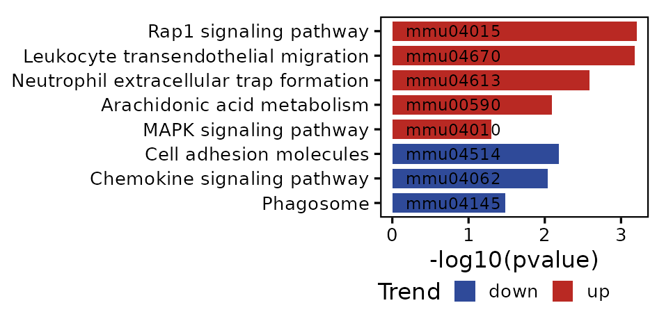

## set-up

```{r set-up}
pkgs <- c("fs", "futile.logger", "configr", "stringr", "ggpubr", "ggthemes", 
          "jhtools", "glue", "ggsci", "patchwork", "tidyverse", "dplyr", "Seurat", 
          "paletteer", "viridis", "ComplexHeatmap", "circlize", "CellChat")  
for (pkg in pkgs){
  suppressPackageStartupMessages(library(pkg, character.only = T))
}
project <- "panlab"
dataset <- "wangchao"
species <- "mouse"
workdir <- glue("~/projects/{project}/output/{dataset}/{species}/tenx/figures_260414")
workdir %>% fs::dir_create() %>% setwd()

config_fn <- "/cluster/home/danyang_jh/projects/panlab/output/wangchao/mouse/tenx/rds/config.yaml"
trends_cols <- jhtools::show_me_the_colors(config_fn, "trends_cols")

my_theme1 <- theme_classic(base_size = 8) +
  theme(legend.key.size = unit(3, "mm"), axis.text = element_text(color = "black"),
        axis.line = element_blank(), axis.ticks = element_line(color = "black"), 
        panel.border = element_rect(linewidth = .5, color = "black", fill = NA))

glue("{workdir}/fig6") %>% fs::dir_create() %>% setwd()

```

## fig6i: KEGG enrichment in bulk RNA-seq

```{r fig6i}
## fig6i: bulk neutrophil kegg enrichment -----
csv_fn4 <- 
  "/cluster/home/danyang_jh/projects/panlab/output/wangchao/mouse/tenx/rds/fig6i_neutrophil_kegg_enrich_res.csv"
res2 <- read_csv(csv_fn4)
terms_sel <- c(
  "Rap1 signaling pathway", "Leukocyte transendothelial migration", 
  "Neutrophil extracellular trap formation", "Arachidonic acid metabolism", 
  "Glycosphingolipid biosynthesis", "MAPK signaling pathway", 
  "Cell adhesion molecules", "Chemokine signaling pathway", "Phagosome"
)
df4barplot <- res2 %>% dplyr::filter(Description %in% terms_sel, pvalue < .1, Count > 3) %>% .[-5, ] %>% 
  dplyr::arrange((trend), desc(pvalue)) %>% mutate(Description = fct(as.character(Description)))
kegg_bar1 <- ggplot2::ggplot(df4barplot, aes(x = -log10(pvalue), y = Description)) + 
  ggplot2::geom_bar(aes(fill = trend), stat = "identity", width = .8) + 
  ggplot2::geom_text(aes(label = ID), x = .8, size = 2) + 
  my_theme1 + theme(legend.position = "bottom", legend.margin = margin(l = -.2, r = .3, t = -.2, b = .1, unit = "cm"), 
                    plot.margin = margin(l = -.2, r = .1, t = .2, b = .2, unit = "cm")) + 
  scale_fill_manual(values = trends_cols) + 
  labs(x = "-log10(pvalue)", y = "", fill = "Trend")
ggsave("fig6i_kegg_enrich_nutrophil_bulk.pdf", kegg_bar1, width = 8, height = 4, unit = "cm")
ggsave("fig6i_kegg_enrich_nutrophil_bulk.png", kegg_bar1, width = 8, height = 4, unit = "cm")

```


